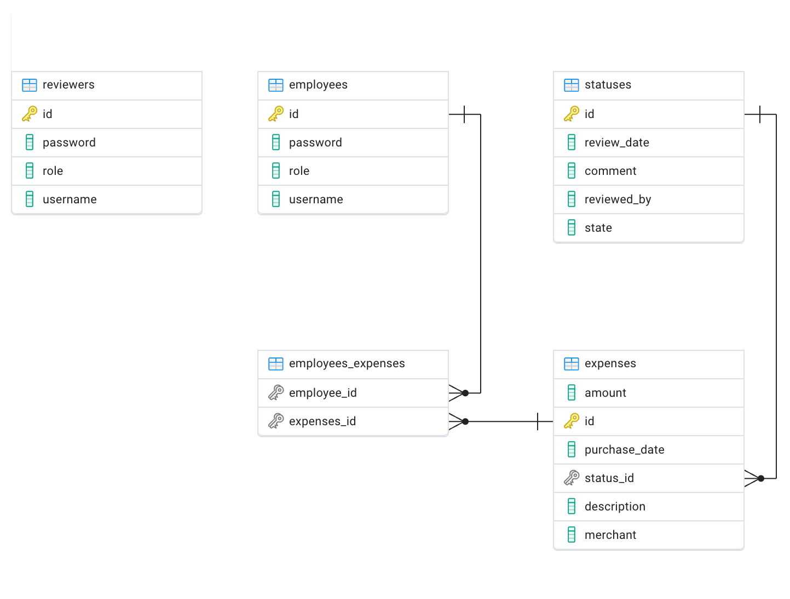

## Expensify Full Stack Project

### Description

The goal of this project is to create a full-stack project that allows employees to view past expense reimbursements, submit new expenses & reviewers to approve them. It has following features:

- User authentication
- User Authorization & Role Based Access Control
- CRUD operations on expenses
- User Roles

### API Endpoints

| Endpoint                                                | Role     | Description                                                  |
| ------------------------------------------------------- | -------- | ------------------------------------------------------------ |
| POST `/login`                                           | PUBLIC   | Expects `username` & `password` field. Sets http cookie with `JSESSIONID`  on success. |
| GET `/employees`                                        | REVIEWER | Get all employees with expenses and expense statuses.        |
| GET `/employees/{employee_id}/expenses`                 | EMPLOYEE | Get all expenses of specified `employee_id `                 |
| DELETE `/employees/{employee_id}/expenses/{expense_id}` | EMPLOYEE | Delete an expense with `expense_id` belonging to `employee_id` |
| UPDATE `/expenses/{expense_id}/status`                  | REVIEWER | Update status of expense with `expense_id`                   |
| POST `/logout`                                          | USER     | Logout from current session                                  |

### Technologies Used

- Spring Boot 3
- Spring Security
- PostgreSQL
- Next JS
- TypeScript

### ER Diagram

